# MediPort 데이터 파트
<table align="center">
  <tr>
    <td align="center">
       
      <small>메인 화면</small>
</table>

### 프로젝트 개요

> 과제 : 지역 균형 발전을 위한 디지털 사회서비스 개발
> 

> 주제 : 외국인의 의료접근성과 복약 편의를 높이는 AI 기반 약정보 매칭 플랫폼
> 

### 기획 배경

문제 정의: 비수도권 고령화와 인구 유출로 인한 지방 소멸 문제

- 최근 외국인 국내 유입 증가로 외국인의 지역 정착 유도가 주목받고 있다.
- 정착 의사에 가장 큰 영향을 미치는 요인은 ‘불충분한 의료 경험’으로 나타났다.

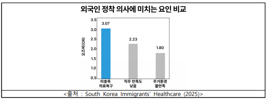

- 불충분한 의료 경험의 이유는 다음과 같이 나타났다.

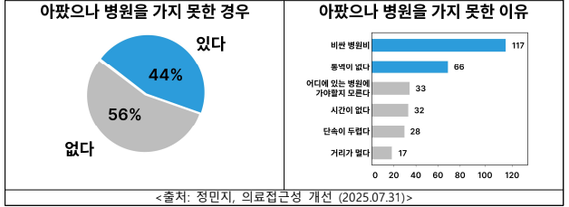

외국인들의 주된 치료 방법은 정기적인 약물 복용(33%)이 가장 높은 비율로 나타났다.

국내에서 외국인들에게 의료접근성을 높이기 위한 통역과 복약 안내, 약품 추천 등의 복합적인 기능을 포함하며, 접근성이 쉬운 플랫폼 개발을 목표로 하였다.

### MVP 설정

1. 주요 기능
- 증상별 일반의약품 추천 챗봇
    
    병원에 가기 어려울 때 증상별 맞춤 일반의약품 추천
    
- 모국약 유사 약품 매칭 서비스
    
    모국에서 복용하던 약과 유사한 국내 약을 찾고 싶을 때 사용
    
- 처방약 모국어 복약 안내
    
    의료기관에서 처방된 약 봉투를 스캔하여 모국어로 복약 안내
    
1. 서브 기능
- 위치 기반 약국 안내
    
    내 위치, 검색 기반 주변 약국의 전화번호, 위치, 운영시간을 지도 API에 따라 리스트 형태로 출력
    
- 의료 기관 음성 통역 서비스
    
    STT ↔ TTS 형태의 외국인의 통역을 도와주는 기능
    
- 반입 · 병용 금기 약품 안내
    - 국내 반입 금지 약품에 따른 금지 성분을 제외한 국내 유사 약품 추천
    - 기저질환에 따른 개인화된 병용 금기 약품 안내

### 데이터셋 및 DB 설계

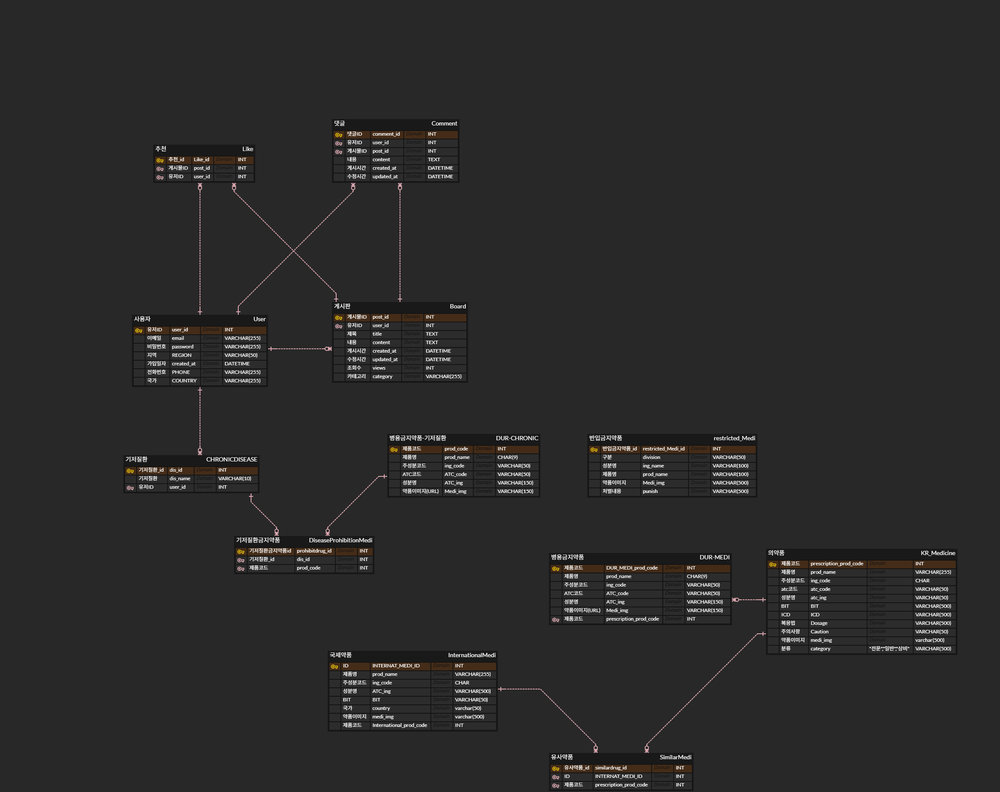

> 필요 데이터셋 정의
> 
- 국내 일반/상비 의약품
- 국내 반입 금기 약품
- 해외 상비/주요 사용 의약품
- 기저질환에 따른 병용 금기 의약품

### 데이터 수집

- 건강보험심사평가원, 공공데이터포털 API 활용
- DrugInfo 민간 데이터셋, Selenium 크롤링 활용

> ISSUE
> 
- [x]  약품 데이터셋 API의 전문성이 높고, 불필요한 데이터가 혼합되어 있어 정제 과정이 필요
- [x]  해외 약품 데이터에 대한 각 국가의 규제 및 정보 제한으로 인한 데이터 수집의 어려움

> SOLUTION
> 
- [ ]  약효 분류 간결화
- [ ]  국내 약품 추천용(사용자 출력용) 자체 데이터셋 구축
- [ ]  용량/제형 세분화
- [ ]  ATC코드 매핑
- [ ]  오픈 웹 기반, 국내 거주 유학생 설문을 통한 해외 약품 수집

### 데이터 전처리/정제

> 전처리
> 
- 데이터 전처리
    - 사용자에게 불필요한 컬럼 제거
    - 공공 약품 API에 크롤링을 수행한 민간 데이터셋을 병합하여 사용자 편의성 컬럼 추가 (복용 시 주의사항, 식품 병용사항 등)
- 용량/제형 세분화
    - 기본 출력으로 제형을 설정하고 약품에 따른 제형을 매핑
    - 약품에 따른 용량을 Depth로 세분화
- 무결성 검사
    - spell_checker 라이브러리를 통한 한국어 복약 안내 맞춤법 검사
    - DB 제약조건 및 JOIN 조건 검사 - 이상치 발생 시 로그 타임스탬프 기록 및 해당 row 출력
    - 약품 이미지 URL 만료 시 자동화 알림 코드 구현
    - 증상별 키워드와 약효 분류 매핑을 통한 키워드 기반 검색을 통해 이상치 발생 시 로그 출력
    

> 정제
> 
- 국가별 약품 언어 통일
    
    국가별로 사용하는 언어가 다수일 경우 가장 많이 사용하는 언어 기준으로 약품명 통일
    
- ATC 코드 매핑
    
    WHO 국제질병분류체계(ATC코드)를 기준으로 국내외 약품을 매핑하여 국가별 약효 분류 일원화
    
- 약품 추천용 자체 데이터셋 구축
    - 국내 반입 금기 약품에 대하여 향정신성 · 마약류 성분을 제외한 국내 유사 약품 추천 데이터셋 구축
    - 해외 상비의약품: 오픈 웹 기반 수집
    - 해외 주요 일반의약품: 국내 거주 외국인 유학생 대상 설문을 통해 약효와 성분을 조사하여 매핑
        
        ⇒ 해외 상비/일반의약품 추천 데이터셋 구축
        
- 약효 분류 간결화
    
    약효 분류가 전문적이거나 사용자가 이해하기 어렵게 세분화 되어 있을 경우
    
    ⇒ 감기, 두통 같은 증상에 따른 키워드를 통해 이해하기 쉽게 약효 분류 간결화 하는 작업 진행
    
- LLM 테스트 데이터 구축
    
    챗봇 AI 모델의 답변 정확성을 위해 사용자 눈높이에 맞는 200개의 키-값(질문-해당 약품) 쌍 형태의 테스트 데이터를 만들어 AI모델 학습과 모델 성능 개선 경험
    

### 해외 약품 매칭(필터링) 과정

> ATC 코드 매핑
> 

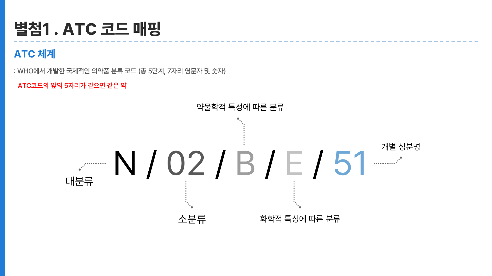

1. 국제질병분류체계를 활용하여 해외 약의 증상에 따른 약효에 따라 ATC코드 매핑

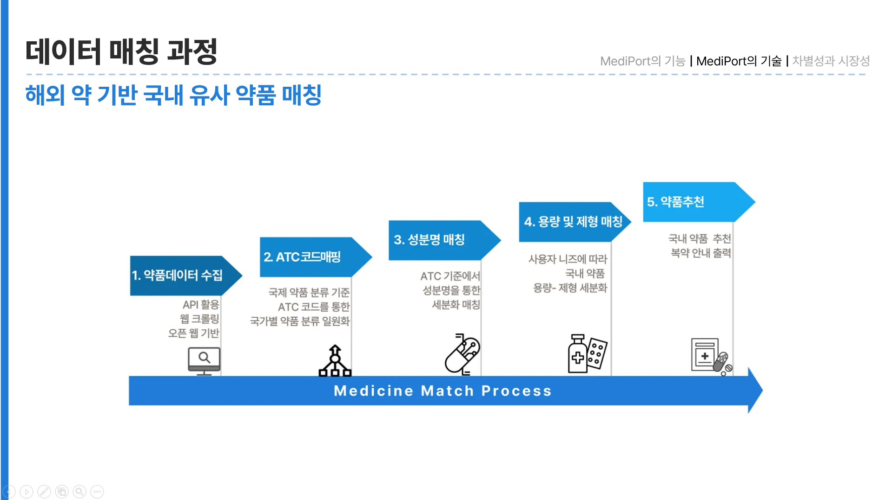

1. 질병을 분류한 상태에서 동일한 주성분을 가지는 약품 매핑
2. 사용자가 니즈에 따라 브랜드/용량/제형을 출력하고 선택

> 최종결과
> 

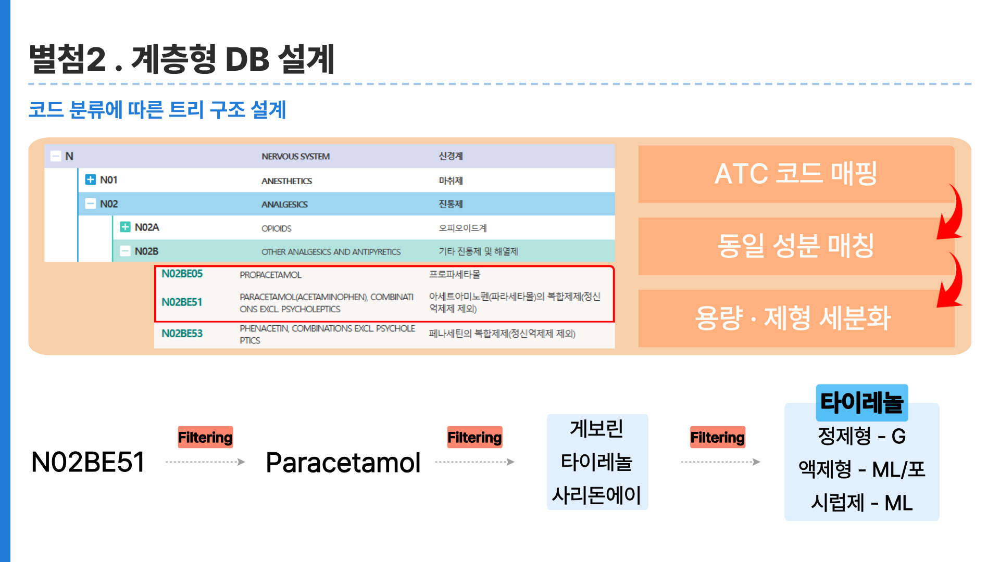

- 약품 직접 추천보다 소거법(Filtering)을 통하여 조건에 맞지 않는 약품을 제외함으로써 마지막 단계에서 사용자 선택을 통해 좀 더 정확한 약품 추천 과정을 수행
- Filtering을 통해 HDBMS 같은 분류에 따른 트리 구조로 설계, DB 구조변경(국가 추가 등)을 고려하여 계층형 DB보다 level 별 Depth를 가지는 관계형 DBMS로 설계

### 데이터 파이프라인

약품 도메인의 무결성과 정확성에 초점을 두어 공공데이터를 수집함. 이를 기반으로 자체 DB를 구축하였음.

<aside>
💡

정형 데이터에 특화된 ETL 파이프라인 구축

</aside>

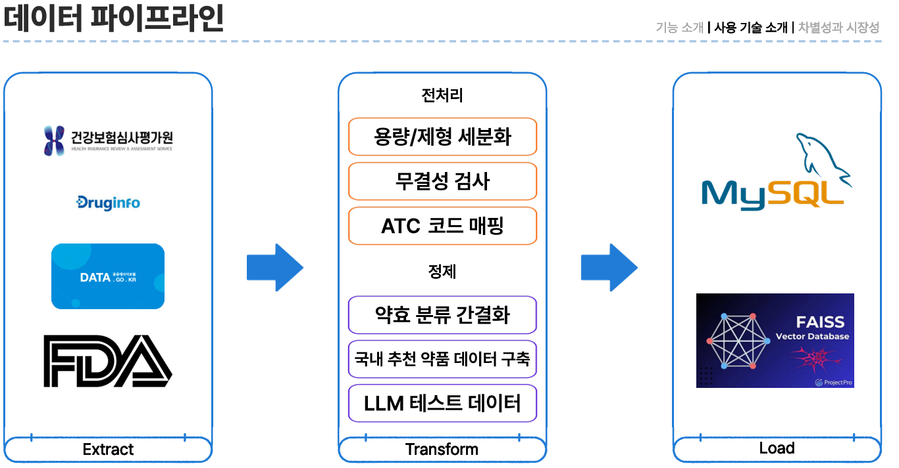

MySQL: 관계형 DBMS를 통해 안정적인 구조화 저장을 구현

FAISS: 벡터 DBMS를 통해 빠르고 효율적인 검색을 가능

⇒ 단순 약품 조회 뿐 아니라, AI 기반 검색과 추천 시스템에 최적화된 환경을 마련

### 서비스

> 시장 분석
> 

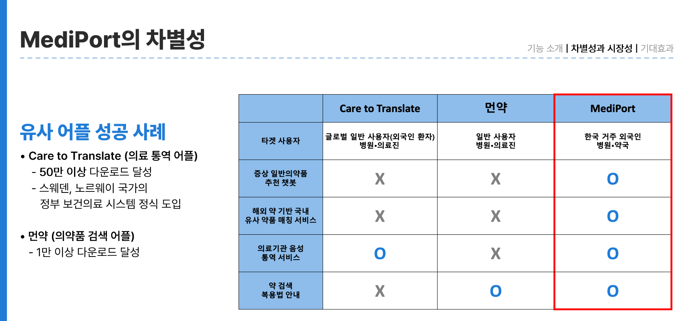

> 서비스 성과
> 
- <출처: NPS, 자체 설문조사>
    - 기간: 25.08.04 ~ 25.08.20
    - 대상: 국내 지방 거주 외국인 200명
    - 설문 방법: 대면 설문 30명, 외국인 밀집 카페 이용

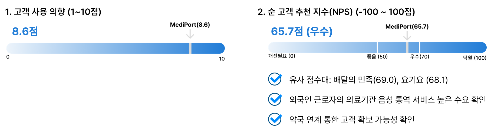

- 생활 밀접형 어플과의 유사 점수를 기록

### 결과물

<table align="center">
  <tr>
    <td align="center">
      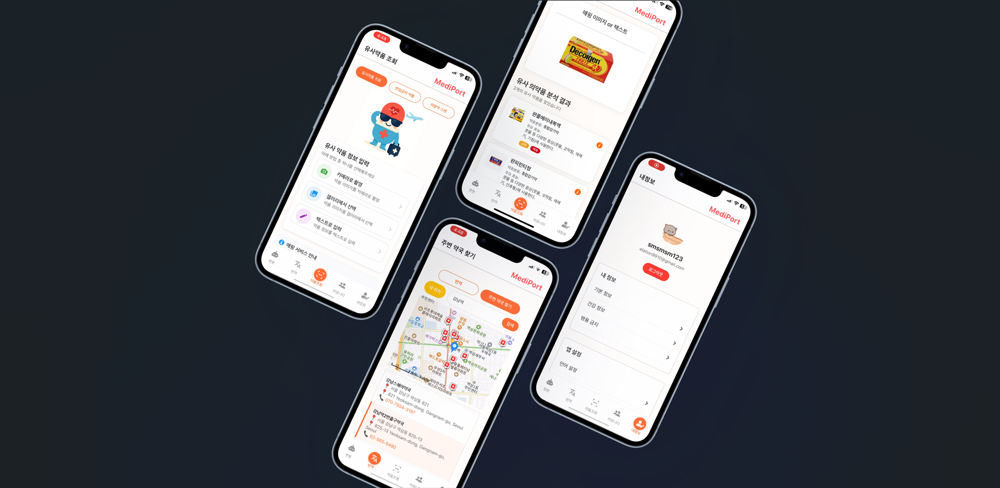 
      <small>결과물</small>
</table>

<table align="center">
  <tr>
    <td align="center">
      <a href="https://www.youtube.com/watch?v=LrSbz9DLeaM" target="_blank" rel="noopener noreferrer">
        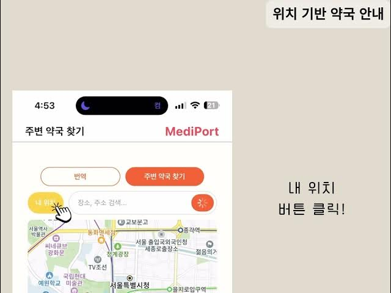
      </a>
        
      <b>🎥 Demo Video</b>
       
      
        <a href="https://www.youtube.com/watch?v=LrSbz9DLeaM" target="_blank" rel="noopener noreferrer">
          시연영상
        </a>
      
    </td>
  </tr>
</table>